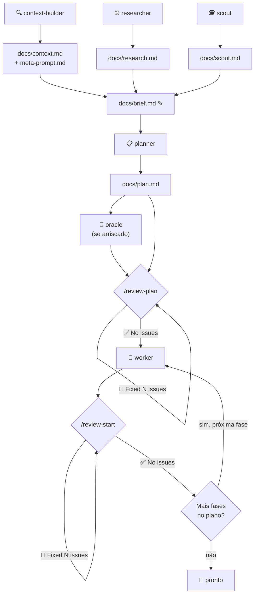

# pi.dev — Guia Prático

> Você descreve **o quê**. O agente decide **como** e executa. Instale, peça em linguagem natural, veja acontecer.

---

## Instalação (uma vez)

```bash
pi install npm:pi-subagents
pi install npm:pi-review-loop
```

Pronto. Não precisa criar agentes, escrever config, nem decorar comandos.

---

## Os 8 Agentes em 8 Frases

| Agente | Faz o quê |
|--------|-----------|
| **context-builder** | Lê requisitos + codebase, gera `context.md` e `meta-prompt.md` com o que importa |
| **researcher** | Pesquisa na web: docs oficiais, benchmarks, breaking changes. Gera `research.md` |
| **scout** | Reconhecimento rápido de código: entry points, fluxo de dados, riscos. Gera `context.md` (cuidado: sobrescreve o do context-builder se usar mesmo path) |
| **planner** | Transforma contexto em plano de implementação concreto. Gera `plan.md`. **Não edita código** |
| **reviewer** | Revisa código contra o plano, testa edge cases, corrige problemas. Pode editar |
| **worker** | Implementa. Edita arquivos, valida, escala decisões não aprovadas. Um escritor por vez |
| **oracle** | Segunda opinião consultiva. Herda contexto, desafia decisões, detecta drift. **Não edita código** |
| **delegate** | Subagente genérico leve quando nenhum especialista se encaixa |

---

## O Fluxo Principal



> `✎` = etapa manual de consolidação (não é output de agente).
> Demais arquivos são outputs padrão dos agentes, redirecionados para `docs/`.

### Passo a passo

**1. Contexto (Brownfield)**

```
"Use o context-builder para analisar os requisitos e a codebase.
 Grave o resultado em docs/"
```

> Output padrão: `context.md` e `meta-prompt.md`. Neste workflow, redirecionamos para `docs/`.

**2. Pesquisa (sempre que houver dependência externa)**

```
"Use o researcher para investigar [tecnologia X] e [biblioteca Y].
 Foco em breaking changes, melhores práticas atuais e benchmarks."
```

**3. Scout (validação do contexto)**

```
"Use o scout para inspecionar [módulo/fluxo específico] que o
 context-builder pode ter deixado passar. Valide [suposição X].
 Grave em docs/scout.md para não sobrescrever o context.md."
```

> ⚠️ Scout e context-builder dividem o mesmo output padrão (`context.md`). Sempre separe.

**4. Brief — consolide o contexto**

Peça ao agente principal juntar tudo em `docs/brief.md`:

```
"Leia docs/context.md, docs/meta-prompt.md, docs/research.md e docs/scout.md.
 Consolide os requisitos, restrições e decisões em docs/brief.md."
```

> `brief.md` é uma etapa manual de consolidação — não é output de agente.
> Serve como entrada única e enxuta para o planner.

**5. Planejamento**

```
"Use o planner para gerar um plano de implementação a partir de docs/brief.md."
```

> Output padrão: `plan.md`. O planner lê `context.md` automaticamente; para usar
> outro arquivo, indique no prompt ou use `reads=docs/brief.md`.

**6. Revisão do plano**

```
"/review-plan leia docs/plan.md e compare com a codebase"
```

O review loop lê o plano contra a codebase, encontra inconsistências, corrige, repete até "No issues found."

Se o plano envolver decisões arriscadas, intercale o oracle:

```
"Use o oracle para revisar o plano. Desafie as decisões de arquitetura.
 O que pode quebrar? Há drift entre o plano e o que já existe?"
```

**7. Implementação**

```
"Use o worker para implementar o plano aprovado."
```

**8. Revisão de código**

```
"/review-start"
```

O loop revisa, corrige, repete até "No issues found." Para foco específico:

```
"/review-start foco tratamento de erros e edge cases"
```

**9. Repita worker → review até esgotar todas as fases do plano.**

> O worker implementa uma fase por vez. Cada fase passa pelo `/review-start`.
> Quando "No issues found", o worker avança para a próxima fase do plano
> (já aprovado pelo `/review-plan`). O ciclo se repete até a última fase.

---

## O Review Loop Explicado

É simples: o agente revisa o próprio trabalho em loop até não encontrar mais nada.

```
/review-start              → revisa código
/review-plan               → revisa plano/especificação
/review-start foco X    → revisa com instrução extra
/review-fresh on           → cada iteração vê o código com "olhos frescos"
/review-exit               → sai manualmente
/review-max 5              → limita a 5 iterações
/review-status             → mostra iteração atual
```

**Por que funciona:** O Geoffrey Huntley documentou o "Ralph Wiggum Loop" — agentes cometem erros diferentes a cada passada. A primeira revisão pega uns bugs, a segunda pega outros, a terceira mais ainda. Sair só quando genuinamente não há mais nada.

**Fresh context (`/review-fresh on`):** Remove iterações anteriores do contexto. Cada passada é realmente independente. Use em revisões críticas.

**Configuração recomendada** (`~/.pi/agent/settings.json`):

```json
{
  "reviewerLoop": {
    "maxIterations": 5,
    "autoTrigger": false,
    "freshContext": true
  }
}
```

---

## Oracle e o Fluxo de Decisão

O oracle **não implementa nada**. Ele é um revisor consultivo que herda o contexto da sessão principal e audita:

- Decisões herdadas (o que já foi decidido antes)
- Drift (onde a direção atual conflita com decisões anteriores)
- Suposições ocultas (o que o agente principal está assumindo sem perceber)
- Riscos e contradições

**O oracle sugere um "execution prompt"** — uma instrução pronta para o worker executar. Mas você (ou o agente principal) decide se aprova antes de passar para o worker.

> **Nota histórica:** o `oracle-executor` existiu como agente separado mas foi consolidado dentro do `worker` (a partir do pi-subagents v1.x). O `worker` atual já incorpora as guardrails de "approved oracle handoff". O fluxo é o mesmo: oracle audita → você aprova → worker implementa.

### Quando usar

| Situação | Use |
|----------|-----|
| Mudança arquitetural de alto risco | oracle → aprova → worker |
| Bug difícil, causa desconhecida | oracle diagnostica → aprova direção → worker corrige |
| Plano complexo com muitas dependências | oracle revisa criticamente → incorpora feedback → worker |
| Suspeita de drift (decisões antigas conflitando com novas) | oracle audita o histórico → realinha |

### Como pedir

```
"Use o oracle para revisar minha direção atual.
 Desafie as suposições e me diga o que estou deixando passar."
```

```
"Use o oracle para diagnosticar a causa raiz deste bug.
 Proponha o melhor próximo passo antes de editarmos qualquer código."
```

O oracle responde com: decisões herdadas, diagnóstico, drift detectado, recomendação, riscos e um **suggested execution prompt** — que você passa para o worker se concordar.

**`oracle-executor` não existe mais como agente separado.** É o padrão: oracle → aprovação → worker.

---

## Receitas

### Feature nova em projeto existente

```
1. "Use o context-builder para mapear o módulo de [X]. Grave em docs/"
2. "Use o researcher para investigar [tecnologia]. Grave em docs/research.md"
3. "Use o scout para validar [suposição]. Grave em docs/scout.md"
4. "Leia os arquivos em docs/ e consolide em docs/brief.md"
5. "Use o planner para gerar um plano a partir de docs/brief.md"
6. "/review-plan leia docs/plan.md"
7. "Use o worker para implementar fase 1 do plano"
8. "/review-start"
9. [Repita 7-8 para cada fase do plano]
```

### Refatoração com segurança

```
1. "Use o scout para mapear o módulo [X]:
    código duplicado, funções longas, acoplamento. Grave em docs/"
2. "Use o planner para criar um plano de refatoração"
3. "/review-plan leia docs/plan.md"
4. "Use o oracle para revisar o plano. O que pode quebrar em produção?"
5. Incorpore o feedback do oracle no plano
6. "Use o worker para implementar fase 1"
7. "/review-start foco regressões"
8. [Repita 6-7 para cada fase. Rode os testes entre fases.]
```

### Code review de PR (sem mexer em código)

```
"Use o reviewer para analisar os arquivos modificados no branch feature/X.
 Compare com main. Liste problemas, riscos e sugestões.
 NÃO faça alterações — só reporte."
```

### Debugging de causa desconhecida

```
"O bug é: [descrição]. Use o oracle para investigar a causa raiz
 e propor o melhor próximo passo."
```

### Chain: scout → planner → worker → reviewer

```
"Use chain: scout para mapear o fluxo de auth →
 planner para criar plano de migração → worker para implementar →
 reviewer para revisar o código."
```

Ou no teclado:

```
/chain scout "mapear auth" -> planner -> worker -> reviewer
```

---

## Anti-Padrões

| ❌ | ✅ |
|----|----|
| "Cria uma API de tasks" (vago demais) | Descreva entidades, endpoints, restrições. Deixe o planner detalhar. |
| "Refatora tudo" (escopo infinito) | "Refatore o módulo X: extraia funções >20 linhas, remova duplicação com Y" |
| "Arruma o bug" (sem stack trace) | Descreva o sintoma, cole o erro, indique o arquivo suspeito |
| Pular `/review-plan` | Plano não revisado = bugs de arquitetura que custam caro depois |
| Pular `/review-start` | Código não revisado = edge cases e erros bobos que passam |
| Implementar tudo de uma vez | Uma fase por vez. Worker → review → worker. |
| Confiar cegamente no plano | Use oracle para decisões de arquitetura e direção |
| `/review-fresh off` em código crítico | Ative fresh context para revisões realmente independentes |
| Pedir "implemente X" sem contexto | Contexto gera plano melhor. Plano melhor gera código melhor. |

---

## Comandos de Referência

| Comando | Efeito |
|---------|--------|
| `/review-start` | Inicia loop de revisão de código |
| `/review-start foco X` | Revisão com instrução extra |
| `/review-plan leia docs/plan.md` | Loop de revisão de plano (passe o caminho como foco) |
| `/review-exit` | Sai do loop |
| `/review-max N` | Limita iterações |
| `/review-fresh on/off` | Ativa/desativa fresh context |
| `/review-status` | Estado atual do loop |
| `/run <agente>` | Lança um agente específico |
| `/chain a -> b -> c` | Pipeline sequencial |
| `/parallel a -> b` | Execução paralela |
| `/agents` | Gerenciador de agentes (Ctrl+Shift+A) |
| `/subagents-status` | Estado de runs assíncronos |
| `/subagents-doctor` | Diagnóstico de configuração |
