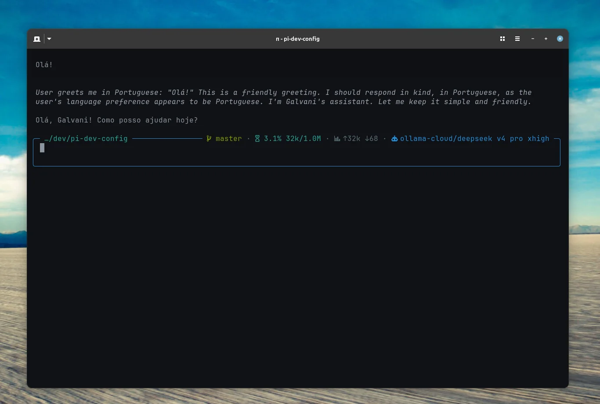

# pi-dev-config

Reproducible [Pi](https://pi.dev) configuration. Clone, install, and run anywhere with the same extensions, skills, and rules.



[](https://github.com/docg1701/pi-dev-config/actions/workflows/ci.yml)

## Contents

- [Quick Start](#quick-start)
- [Skills](#skills)
- [Extensions](#extensions)
- [Themes](#themes)
- [Settings & Models](#settings--models)
- [Provider Setup](#provider-setup)
- [Working Vibes](#working-vibes)
- [Notifications](#notifications)
- [Ghostty](#ghostty)
- [Context & Rules](#context--rules)
- [CI & Validation](#ci--validation)
- [Repository Structure](#repository-structure)
- [Troubleshooting](#troubleshooting)
- [License](#license)

## Quick Start

```bash
# Clone
git clone git@github.com:docg1701/pi-dev-config.git ~/dev/pi-dev-config

# Install extensions
pi install npm:pi-subagents
pi install npm:pi-prompt-template-model
pi install npm:pi-agent-browser-native
pi install npm:pi-extension-manager
pi install npm:pi-mcp-adapter
pi install npm:pi-mermaid
pi install npm:pi-smart-fetch
pi install npm:pi-glance
pi install npm:@eko24ive/pi-ask
pi install npm:@leonardorick/pi-web-search
pi install npm:pi-ollama-cloud
pi install npm:pi-alert
pi install npm:pi-working-vibe
pi install npm:@victor-software-house/pi-curated-themes

# Install skills
npx skills add https://github.com/upstash/context7 --skill find-docs
npx skills add https://github.com/199-biotechnologies/claude-deep-research-skill --skill deep-research
npx skills add https://github.com/vercel-labs/skills --skill find-skills
npx skills add https://github.com/streamlit/agent-skills --skill developing-with-streamlit
npx skills add https://github.com/aj-geddes/useful-ai-prompts --skill ansible-automation
npx skills add https://github.com/coreyhaines31/marketingskills --skill product-marketing
npx skills add https://github.com/obra/superpowers --skill systematic-debugging

# Copy APPEND_SYSTEM.md to extend the agent's system prompt
cp ~/dev/pi-dev-config/APPEND_SYSTEM.md ~/.pi/agent/APPEND_SYSTEM.md

# Copy custom vibe files
cp ~/dev/pi-dev-config/vibes/*.txt ~/.pi/agent/vibes/

# Copy settings
cp ~/dev/pi-dev-config/settings.json ~/.pi/agent/settings.json

# Reload pi
# /reload
```

## Skills

### Skills.sh registry

| Name | Description | Install |
|------|-------------|---------|
| `find-docs` | Library docs via Context7 CLI. Prefer over web search. | `npx skills add https://github.com/upstash/context7 --skill find-docs` |
| `deep-research` | 8-phase citation-backed research. Quick/standard/deep/ultradeep. | `npx skills add https://github.com/199-biotechnologies/claude-deep-research-skill --skill deep-research` |
| `find-skills` | Discover and install skills from the open skills ecosystem. | `npx skills add https://github.com/vercel-labs/skills --skill find-skills` |
| `developing-with-streamlit` | Official Streamlit routing skill: creation, editing, debug, styling, performance, themes, deploy, and custom components. | `npx skills add https://github.com/streamlit/agent-skills --skill developing-with-streamlit` |
| `ansible-automation` | Infrastructure automation with Ansible playbooks, roles, and inventory. | `npx skills add https://github.com/aj-geddes/useful-ai-prompts --skill ansible-automation` |
| `product-marketing` | Create `.agents/product-marketing.md` (foundational positioning/messaging). Use first before other marketing skills. | `npx skills add https://github.com/coreyhaines31/marketingskills --skill product-marketing` |
| `systematic-debugging` | 4-phase root-cause debugging. Includes root-cause-tracing, defense-in-depth, condition-based-waiting. | `npx skills add https://github.com/obra/superpowers --skill systematic-debugging` |
| `ask-user` | Reinforces when to use `ask_user` for structured clarification instead of guessing. | Bundled with `@eko24ive/pi-ask` |

### Marketing suite

All from [`coreyhaines31/marketingskills`](https://github.com/coreyhaines31/marketingskills). Install the full suite with `npx skills add https://github.com/coreyhaines31/marketingskills --skill product-marketing`.

| Name | Description |
|------|-------------|
| `product-marketing` | Foundational positioning and messaging context. Use first. |
| `marketing-ideas` | 139 proven marketing ideas for SaaS. |
| `content-strategy` | Plan content strategy, topic clusters, editorial calendar, and content pillars. |
| `copywriting` | Write or improve marketing copy for homepages, landing pages, pricing, and product pages. |
| `copy-editing` | Edit, review, and tighten existing marketing copy. |
| `seo-audit` | Technical and on-page SEO audits; diagnose ranking issues. |
| `programmatic-seo` | Create SEO-driven pages at scale using templates and data. |
| `ai-seo` | Optimize content for AI search engines and LLM citations. |
| `schema` | Add, fix, or optimize schema markup and structured data. |
| `site-architecture` | Plan and restructure page hierarchy, navigation, URL structure, and internal linking. |
| `analytics` | Set up, improve, or audit analytics tracking (GA4, GTM, Mixpanel, Segment). |
| `ab-testing` | Plan, design, and implement A/B tests and growth experiments. |
| `cro` | Conversion rate optimization for landing pages, forms, and marketing pages. |
| `signup` | Optimize signup, registration, and trial activation flows. |
| `onboarding` | Optimize post-signup onboarding, user activation, and time-to-value. |
| `paywalls` | Create and optimize in-app paywalls, upgrade screens, and upsell modals. |
| `churn-prevention` | Build cancellation flows, save offers, dunning, and retention strategies. |
| `pricing` | Pricing decisions, packaging, and monetization strategy. |
| `ads` | Paid advertising campaigns (Google Ads, Meta, LinkedIn, Twitter/X). |
| `ad-creative` | Generate and iterate ad copy, headlines, and creative variations at scale. |
| `social` | Social media content creation, scheduling, and optimization. |
| `video` | Create and produce video content with AI tools and programmatic frameworks. |
| `image` | Create, generate, edit, or optimize marketing images and brand assets. |
| `emails` | Email sequences, drip campaigns, lifecycle email programs, and nurture flows. |
| `cold-email` | B2B cold emails and follow-up sequences that get replies. |
| `sms` | SMS/MMS marketing flows, abandoned cart texts, and promotional sends. |
| `popups` | Popups, modals, overlays, slide-ins, and banners for conversion. |
| `lead-magnets` | Create and optimize lead magnets for email capture and lead generation. |
| `free-tools` | Plan and build free tools for lead generation, SEO value, and brand awareness. |
| `directory-submissions` | Submit product to startup/SaaS/AI directories for backlinks and discovery. |
| `referrals` | Create and optimize referral, affiliate, and word-of-mouth programs. |
| `co-marketing` | Find co-marketing partners and plan joint campaigns. |
| `community-marketing` | Build and leverage online communities for product growth and brand loyalty. |
| `competitor-profiling` | Research, profile, and analyze competitors from their URLs. |
| `competitors` | Create competitor comparison and alternative pages for SEO and sales enablement. |
| `prospecting` | Find, qualify, and build lists of B2B prospects. |
| `sales-enablement` | Create sales collateral, pitch decks, one-pagers, objection handling, and demo scripts. |
| `revops` | Revenue operations, lead lifecycle management, and marketing-to-sales handoff. |
| `customer-research` | Conduct, analyze, and synthesize customer research, interviews, and surveys. |
| `aso` | Audit and optimize App Store and Google Play listings. |
| `marketing-psychology` | Apply psychological principles and behavioral science to marketing. |
| `launch` | Product launch, feature announcement, and release strategy. |

### Other official registries

- [Anthropic Skills](https://github.com/anthropics/skills) — document processing, web dev.
- [Pi Skills](https://github.com/badlogic/pi-skills) — web search, browser automation, Google APIs, transcription.

## Extensions

| Name | Description | Install |
|------|-------------|---------|
| `pi-subagents` | Delegate tasks to subagents with chains, parallel execution, TUI clarification, and async support. | `pi install npm:pi-subagents` |
| `pi-prompt-template-model` | Prompt templates with model/skill frontmatter and slash commands. | `pi install npm:pi-prompt-template-model` |
| `pi-agent-browser-native` | `agent-browser` as a native tool. Snapshots, screenshots, sessions. | `pi install npm:pi-agent-browser-native` |
| `pi-extension-manager` | `/extensions` command for local and community package management. Includes auto-update checker (off by default — enable with `/extensions auto-update daily`). | `pi install npm:pi-extension-manager` |
| `pi-mcp-adapter` | Token-efficient MCP proxy. Lazy servers, cached metadata. | `pi install npm:pi-mcp-adapter` |
| `pi-mermaid` | Mermaid diagrams as ASCII art in TUI. | `pi install npm:pi-mermaid` |
| `pi-smart-fetch` | Smarter `web_fetch` with TLS fingerprinting and Defuddle extraction. | `pi install npm:pi-smart-fetch` |
| `pi-glance` | Calm input surface with rounded multiline editor and inline status (model · context · tokens · cost · git). 10 built-in themes. | `pi install npm:pi-glance` |
| `@eko24ive/pi-ask` | Ask tool with structured questions (single/multi/preview), option notes, elaboration flow, and native `@` file references. | `pi install npm:@eko24ive/pi-ask` |
| `@leonardorick/pi-web-search` | Real DuckDuckGo web search as a native `web_search` tool. Companion to `pi-smart-fetch`. | `pi install npm:@leonardorick/pi-web-search` |
| `pi-ollama-cloud` | Ollama Cloud provider with dynamic model discovery, persistent cache, and built-in `ollama_web_search`/`ollama_web_fetch` tools. | `pi install npm:pi-ollama-cloud` |
| `pi-alert` | System notification when the agent finishes its turn. Terminal-native (Ghostty, iTerm2, WezTerm, Kitty, rxvt-unicode) with OS fallback. | `pi install npm:pi-alert` |

## Themes

| Name | Description | Install |
|------|-------------|---------|
| `@victor-software-house/pi-curated-themes` | 65 curated dark terminal themes adapted from iTerm2-Color-Schemes to pi's 51-token model. Semantic variants with guaranteed hue separation. | `pi install npm:@victor-software-house/pi-curated-themes` |

Select a theme in `/settings`, or set it in `~/.pi/agent/settings.json`:

```json
{
  "theme": "catppuccin-mocha"
}
```

Available themes include `catppuccin-mocha`, `dracula`, `gruvbox-dark`, `kanagawa-wave`, `everforest-dark-hard`, `lovelace`, `mellow`, `vesper`, and 57 others. See the [full curated list](https://github.com/victor-software-house/pi-curated-themes).

## Settings & Models

Pi looks for a single file at `~/.pi/agent/settings.json`. The destination file must always be named `settings.json` — pi does not read any other filename directly.

```bash
cp ~/dev/pi-dev-config/settings.json ~/.pi/agent/settings.json
# /reload
```

### Model catalog

This repository targets the [Ollama Cloud](https://ollama.com) catalog via [`pi-ollama-cloud`](https://github.com/fgrehm/pi-ollama-cloud). Capabilities below come from the live Ollama Cloud `/api/show` endpoint — run `/ollama-cloud-refresh` to refresh them locally.

| Model | Params | Vision | Thinking | Context | Usage (ollama.com) | Role |
|-------|--------|--------|----------|---------|--------------------|------|
| `minimax-m3` | undisclosed | yes | yes | 512K | high (3/4) | Researcher, delegate |
| `nemotron-3-ultra` | 550B | no | yes | 256K | high (3/4) | Disabled by default — see [Troubleshooting](#troubleshooting); re-test target 2026-06-11 |
| `deepseek-v4-pro` | undisclosed | no | yes | 512K | **extra heavy (4/4)** | Context-builder (where reasoning depth justifies cost) |
| `deepseek-v4-flash` | 158B | no | yes | 1M | low (2/4) | Scout (fast, cheap) |
| `kimi-k2.7-code` | 1.04T | yes | yes | 256K | high (3/4) | Default orchestrator, reviewer |
| `glm-5.2` | 756B | no | yes | 1M | high (3/4) | Planner, worker, oracle |

> **Note:** The default orchestrator is `kimi-k2.7-code` with `defaultThinkingLevel: "xhigh"`. For `deepseek*` and `glm-5.2`, `xhigh` maps to `max` thinking effort (graduated). For `minimax*`, `kimi*`, `glm-5`, and `nemotron*` it is effectively a no-op because those models expose thinking as a binary toggle, not a graduated effort level.
>
> **⚠️ Context window may not match vendor specs.** The models below are advertised by their vendors with larger context windows than the values currently returned by the Ollama Cloud `/api/show` endpoint. The original model specs are shown in the table; the reduced values are what pi sees from Ollama Cloud today:
>
> | Model | Vendor advertised | Ollama Cloud (current) | Source |
> |---|---|---|---|
> | `deepseek-v4-pro` | 1M | 512K | [Ollama Cloud](https://ollama.com/library/deepseek-v4-pro) |
> | `minimax-m3` | 1M (guaranteed minimum per the vendor) | 512K | [MiniMax docs](https://www.minimax.io/models/text/m3) |
> | `nemotron-3-ultra` | 1M | 256K | [NVIDIA Nemotron 3 Ultra](https://docs.api.nvidia.com/nim/reference/nvidia-nemotron-3-ultra-550b-a55b) |
>
> When Ollama Cloud raises these limits, re-run `/ollama-cloud-refresh` in pi and
> update the `Context` column in this table to match the live value reported in
> `~/.pi/agent/cache/ollama-cloud-models.json`. If a model stops being available
> entirely, re-validate the subagent mappings in
> [Subagent models](#subagent-models) against whatever replaces it.

### Subagent models

| Subagent | Model | Thinking |
|----------|-------|----------|
| scout | `deepseek-v4-flash` (fast) | `xhigh` |
| planner | `glm-5.2` | `xhigh` |
| worker | `glm-5.2` | `xhigh` |
| reviewer | `kimi-k2.7-code` | `high` |
| oracle | `glm-5.2` | `xhigh` |
| context-builder | `deepseek-v4-pro` | `xhigh` |
| researcher | `kimi-k2.7-code` | `high` |
| delegate | `kimi-k2.7-code` | `high` |

### Thinking rules

Per family, sourced from each creator's official docs:

- **`deepseek*` → `xhigh`.** The [DeepSeek API docs](https://api-docs.deepseek.com/guides/thinking_mode) define exactly two effort levels — `high` and `max` — and document that `xhigh` maps to `max`. Default is `high`; [complex agent requests (Claude Code, OpenCode) are auto-promoted to `max`](https://api-docs.deepseek.com/guides/thinking_mode). The [DeepSeek-V4 model card](https://huggingface.co/deepseek-ai/DeepSeek-V4-Pro) shows measurable gains from `max` over `high` on agentic benchmarks (Apex 27.4→38.3, BrowseComp 53.5→73.2, LiveCodeBench 88.4→91.6 for V4-Flash). This config runs agentic loops, so `xhigh` is the right level.
- **`glm-5.2` → `xhigh`.** [GLM-5.2 is the first in the GLM family to support `reasoning_effort`](https://docs.z.ai/guides/capabilities/thinking). Values: `max` (default, recommended), `xhigh`, `high`, `medium`, `low`, `minimal`, `none`. `xhigh` maps to `max`; `low`/`medium` map to `high`. Use `xhigh` for agentic workloads.
- **`minimax*`, `nemotron*`, `kimi*`, `glm-5` → `high`.** The creator docs for [MiniMax M3](https://minimax.io/blog/minimax-m3), [NVIDIA Nemotron 3 Ultra](https://docs.api.nvidia.com/nim/reference/nvidia-nemotron-3-ultra-550b-a55b), [Kimi K2.7 Code](https://platform.kimi.ai/docs/guide/use-kimi-k2-thinking-model), and [GLM-5.1](https://huggingface.co/zai-org/GLM-5.1) expose thinking as a binary on/off toggle, not as a graduated effort level. The `pi-ollama-cloud` extension passes `max` for `xhigh` to the OpenAI-compat endpoint, but those models do not differentiate between `high` and `max` — the parameter is effectively a no-op. Use `high` to keep the config honest; pushing to `xhigh` is wasted quota.
- The default orchestrator (`kimi-k2.7-code`) sits at `xhigh` via `defaultThinkingLevel`. For Kimi this is a no-op (binary thinking), but the setting is kept at `xhigh` so that switching the default model to a `deepseek*` or `glm-5.2` model does not silently downgrade thinking effort.

## Provider Setup

### Ollama Cloud

[pi-ollama-cloud](https://github.com/fgrehm/pi-ollama-cloud) registers Ollama Cloud as a model provider with dynamically fetched models and built-in web search/fetch tools.

**Setup:**

```bash
# 1. Get an API key at ollama.com and set it
export OLLAMA_API_KEY="your-ollama-cloud-api-key"
# Or add it to ~/.pi/agent/auth.json:
# { "ollama-cloud": { "type": "api_key", "key": "your-key" } }

# 2. Fetch the full model list (run after install and whenever models change)
/ollama-cloud-refresh
```

On first launch (before `/ollama-cloud-refresh`), a small set of fallback models is used. After refresh, all tool-capable Ollama Cloud models become available under the `ollama-cloud` provider — switch with `/model` or `Ctrl+L`. Models are cached at `~/.pi/agent/cache/ollama-cloud-models.json` (never expires; refresh manually).

**Tools added:**

| Tool | Description |
|------|-------------|
| `ollama_web_search` | Web search via Ollama Cloud's search API |
| `ollama_web_fetch` | Web page fetch and extraction via Ollama Cloud |

Both use the same API key configured for the provider — no local Ollama server needed. These coexist with `web_search` (DuckDuckGo via `pi-web-search`) and `web_fetch` (via `pi-smart-fetch`).

> **Recommendation:** run `/ollama-webtools off` to disable `ollama_web_search` and `ollama_web_fetch`. They are inferior to DuckDuckGo's `web_search` and TLS-fingerprinted `web_fetch` — Ollama tends to prefer its own tools when available, even when the results are worse. With `/ollama-webtools off`, the model falls back to the higher-quality tools automatically.

## Working Vibes

[pi-working-vibe](https://github.com/Davidcreador/pi-working-vibe) replaces pi's default `Working…` message with themed flavor text that rotates while the agent thinks, and auto-switches per tool (`bash`, `read`, `edit`, `write`, `grep`, `find`, `ls`, `web_search`, `web_fetch`, `todo`).

This repo includes **four** custom vibe files:

| Theme | File | Phrases | Flavor |
|-------|------|---------|--------|
| `startrek` | `vibes/startrek.txt` | 99 | Engaging warp drive, scanning for lifeforms... |
| `klingon` | `vibes/klingon.txt` | 26 | Qapla'! bortaS bIr jablu'DI'... (with translation) |
| `dadjokes` | `vibes/dadjokes.txt` | 200+ | Hi Hungry, I'm Dad... Surely you can't be serious... |
| `bbs` | `vibes/bbs.txt` | 52 | NO CARRIER... l33t skillz... RTFM... |

### Setup

```bash
# 1. Install the extension
pi install npm:pi-working-vibe

# 2. Copy custom vibe files to your global config
cp ~/dev/pi-dev-config/vibes/*.txt ~/.pi/agent/vibes/

# 3. Copy settings
cp ~/dev/pi-dev-config/settings.json ~/.pi/agent/settings.json

# 4. Reload pi
# /reload
```

`settings.json` is pre-configured with `workingVibe: true` and `workingVibeName: "startrek"`. Bundled themes from the extension (`mafia`, `hacker`, `pirate`, `zen`) remain available — switch with `/vibe vibe:<name>`.

### Vibe file format

Vibe files are plain text. One phrase per line, terminating in `...`. `#` for comments. Optional `[section]` headers split lines into pools:

```
# startrek.txt
Engaging warp drive...
Scanning for lifeforms...

[tool:bash]
Diverting power to shields...

[tool:read]
Extending sensor pallets...
```

Pools fall back to `[default]` when the active tool has no dedicated section. Files without headers become one big default pool (backward compatible).

### Commands

| Command | Effect |
|---------|--------|
| `/vibe` | Toggle master switch |
| `/vibe on` / `/vibe off` | Enable / disable |
| `/vibe list` | List installed vibes (user + bundled) |
| `/vibe info` | Show active settings + line counts |
| `/vibe pools` | List sections in the active vibe |
| `/vibe preview` | Pick a sample line from the active pool |
| `/vibe reload` | Re-read settings + vibe file from disk |
| `/vibe vibe:<name>` | Switch active vibe |
| `/vibe indicator:<preset>` | `default` \| `dots` \| `line` \| `pulse` \| `braille` \| `arrow` \| `custom` |
| `/vibe color:<token>` | Theme color for spinner (e.g. `accent`, `primary`, `dim`) |
| `/vibe rotate:<ms>` | Message rotation interval (`0` = static) |
| `/vibe interval:<ms>` | Spinner frame interval |

### Switching themes

```
/vibe vibe:startrek     # Back to Starfleet
/vibe vibe:klingon      # Qapla'! — Klingon with translations
/vibe vibe:dadjokes     # Hi Hungry, I'm Dad...
/vibe vibe:bbs          # NO CARRIER...
/vibe vibe:mafia        # Bundled with the extension
/vibe off               # Disable vibes
```

User files in `~/.pi/agent/vibes/` override bundled files of the same name, so you can fork `startrek.txt` without losing package updates.

### Settings reference

| Key | Type | Default | Effect |
|-----|------|---------|--------|
| `workingVibe` | boolean | `true` | Master switch |
| `workingVibeName` | string | `"mafia"` | Vibe file name (no `.txt`) |
| `workingVibeRotateMs` | number | `3500` | Rotation interval; `0` = static. Floor 750ms |
| `workingIndicator` | enum | `"default"` | Spinner preset |
| `workingIndicatorColor` | string | `"accent"` | Theme color token |
| `workingIndicatorFrames` | string[] | `[]` | Custom frames (when `workingIndicator: "custom"`) |
| `workingIndicatorIntervalMs` | number | `90` | Spinner frame interval. Floor 40ms |

## Notifications

[pi-alert](https://github.com/maxpetretta/pi-alert) sends a system notification when the agent finishes its turn. Notifications fire automatically after every prompt — no configuration needed.

**Notification body** shows an activity summary with elapsed time, prioritizing the most useful signal from the completed run: updated files → other tool calls → read files → generic completion fallback. **Title** uses the project root directory name (e.g. `pi — pi-dev-config`).

### Delivery

Terminal-native notifications when running in a supported terminal:

| Terminal | Protocol |
|----------|----------|
| Ghostty | OSC 777 |
| iTerm2 | OSC 9 |
| WezTerm | OSC 777 |
| Kitty | OSC 99 |
| rxvt-unicode | OSC 777 |
| tmux | Passthrough to outer terminal |

When no terminal-native transport is available, pi-alert falls back to the OS:

| OS | Fallback |
|----|----------|
| macOS | `osascript` with native notification + `Glass` sound |
| Linux | `notify-send` (install `libnotify-bin` if missing) |
| Windows | PowerShell `NotifyIcon` balloon notification |
| Final resort | Terminal bell (`BEL`) |

## Ghostty

Terminal configuration for development with pi.

| File | Description |
|---------|-----------|
| `ghostty/config.ghostty` | GitHub Dark theme, JetBrains Mono 12px, blinking bar cursor, padding 8x4, shell integration |
| `ghostty/SSH_NERD_FONT.md` | Guide for Nerd Font icons to work over SSH (Ghostty → VPS) |

To enable Nerd Font icons in the status line over SSH, add `TERM_PROGRAM TERM_PROGRAM_VERSION` to the sshd `AcceptEnv` on the VPS — see `ghostty/SSH_NERD_FONT.md`.

```bash
cp ~/dev/pi-dev-config/ghostty/config.ghostty ~/.config/ghostty/config.ghostty
```

Restart Ghostty completely after copying.

## Context & Rules

Pi loads two kinds of instruction files at startup:

| File | Scope | Purpose |
|------|-------|---------|
| `APPEND_SYSTEM.md` | Global (`~/.pi/agent/`) | Extends the **system prompt** — behavioral rules and conventions that apply to every session (code style, testing, logging, etc.). Appended without replacing the native prompt. |
| `AGENTS.md` | Per-project | Project-level **context** — stack, conventions, build commands, and local rules. Pi concatenates all `AGENTS.md` found from `cwd` up through parent directories plus `~/.pi/agent/`. |

This repo ships a reusable `APPEND_SYSTEM.md` with language-agnostic coding rules. Copy it once to your global config. For project-specific instructions, create `AGENTS.md` at the project root — no example is included because it should be customized per project (tech stack, build commands, team conventions).

### AGENTS.md best practices

See `docs/research/AGENTS.md-analysis-20260529.md` for a comprehensive research report (14 sources, 6 core areas). Key takeaways:

- **6 core areas** every AGENTS.md should cover: Commands, Testing, Project Structure, Code Style, Git Workflow, Boundaries.
- **Commands at the top** with exact flags, copy-pasteable — highest-ROI section.
- **Boundaries with 3 levels** (Always / Ask first / Never) — single most effective constraint pattern.
- **Code examples over descriptions** — one real snippet beats three paragraphs.
- **≤150–180 lines is the sweet spot** — every extra line consumes context tokens.
- **No changelog or human documentation** — AGENTS.md is a runtime instruction set; README.md is for humans.

## CI & Validation

[`.github/workflows/ci.yml`](.github/workflows/ci.yml) runs on every push, PR, and `v*.*.*` tag.

- **`validate` job** — runs [`validate.py`](validate.py) on every change. Validates that all JSON, TOML, and Markdown files in the repo parse correctly and that `settings.json` has the required keys (`packages`, `defaultProvider`, `defaultModel`, `enabledModels`).
- **`release` job** — fires only on `v*.*.*` tags. Categorizes the commits since the previous tag into Added (`feat`), Fixed (`fix`), and Changed (`chore`/`docs`/`ci`/`refactor`/`style`/`test`/`perf`/`revert`/`build`), and creates a GitHub release with auto-generated notes.

Run `validate.py` locally before pushing:

```bash
python3 validate.py
```

See [`docs/ci-auto-release-guide.md`](docs/ci-auto-release-guide.md) for the full release workflow.

## Repository Structure

```
pi-dev-config/
├── APPEND_SYSTEM.md               # Global system-prompt rules and conventions
├── settings.json                  # Pre-configured pi settings (Ollama Cloud provider)
├── validate.py                    # Local pre-push validator (JSON/TOML/Markdown)
├── VERSION                        # Current release version (single source of truth)
├── assets/                        # Static assets (images, etc.)
├── .github/
│   └── workflows/
│       └── ci.yml                 # CI: validate on push/PR, auto-release on tags
├── docs/
│   ├── ci-auto-release-guide.md         # Full release workflow guide
│   ├── DESIGN.md                        # Cal.com design system analysis (Dembrandt)
│   ├── PI_DEV_CHEATSHEET_EN.md          # Practical workflow guide (EN)
│   ├── streamlit_pro_tips.md            # 25+ Streamlit PRO tips from official video
│   ├── streamlit_extras_guide.md        # streamlit-extras complete reference guide
│   └── research/
│       └── AGENTS.md-analysis-20260529.md  # AGENTS.md industry standard research (14 sources)
├── ghostty/
│   ├── config.ghostty             # GitHub Dark, JetBrains Mono, shell integration
│   └── SSH_NERD_FONT.md           # Nerd Font icons over SSH guide
├── vibes/
│   ├── startrek.txt               # Startrek: 99 phrases
│   ├── klingon.txt                # Klingon + translations: 26 phrases
│   ├── dadjokes.txt               # Dad jokes: 200+ phrases
│   └── bbs.txt                    # BBS taglines 90s: 52 phrases
└── README.md                      # This file
```

## Troubleshooting

### `auto-update off` in the status bar

This is the status of `pi-extension-manager`. It means automatic package update checking is disabled. To enable:

```
/extensions auto-update daily
```

Other intervals: `weekly`, `1h`, `6h`, `3d`, `2w`, `1mo`, or run `/extensions auto-update` for the interactive wizard.

### `nemotron-3-ultra`: past incident and re-test plan

- **2026-06-04 (first deploy):** Nemotron-3-ultra was deployed as `worker` + `researcher`. It burned ~20M tokens across 29 requests and drained the Pro quota. Ollama Cloud subsequently reset session and weekly usage counters (observed same day), suggesting a **provider-side** fix for a runaway thinking loop.
- **2026-06-04 (re-deploy attempt):** Re-deployed after the Ollama Cloud reset. The runaway recurred. Nemotron-3-ultra was removed from `enabledModels`; `worker` + `researcher` reverted to M3.
- **Re-test target: 2026-06-11** (one week after the second removal). To re-enable for testing, set the following in `agentOverrides` and add `"nemotron-3-ultra"` back to `enabledModels`:

  ```json
  "worker":     { "model": "nemotron-3-ultra", "thinking": "high" },
  "researcher": { "model": "nemotron-3-ultra", "thinking": "high" }
  ```

  **If the runaway recurs on the re-test:** pull nemotron again and push the re-test target by another week. The trigger is a single request burning >1M tokens, or Pro quota dropping by more than 10% in one worker run.

## License

MIT
