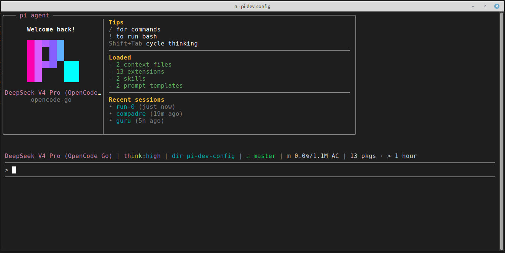

# pi-dev-config

Reproducible [Pi](https://pi.dev) configuration. Clone, install, and run anywhere with the same extensions, skills, and rules.



## Quick Start

```bash
# Clone into ~/.pi/agent/ or any project
git clone git@github.com:docg1701/pi-dev-config.git ~/.pi/agent/config

# Install extensions
pi install npm:pi-review-loop
pi install npm:pi-annotate
pi install npm:pi-interview
pi install npm:pi-prompt-template-model
pi install npm:pi-subagents
pi install npm:pi-agent-browser-native
pi install npm:pi-extension-manager
pi install npm:pi-mcp-adapter
pi install npm:pi-mermaid
pi install npm:pi-smart-fetch
pi install npm:pi-powerline-footer
pi install npm:@eko24ive/pi-ask
pi install npm:@leonardorick/pi-web-search
pi install npm:pi-ollama-cloud
pi install npm:pi-alert

# Install skills
npx skills add https://github.com/upstash/context7 --skill find-docs
npx skills add https://github.com/199-biotechnologies/claude-deep-research-skill --skill deep-research
npx skills add https://github.com/vercel-labs/skills --skill find-skills
npx skills add https://github.com/streamlit/agent-skills --skill developing-with-streamlit
npx skills add https://github.com/aj-geddes/useful-ai-prompts --skill ansible-automation

# Copy APPEND_SYSTEM.md to extend the agent's system prompt
cp ~/dev/pi-dev-config/APPEND_SYSTEM.md ~/.pi/agent/APPEND_SYSTEM.md

# Copy ONE of the settings variants to ~/.pi/agent/settings.json (see "Settings Variants" below)
# Variant A — ollama-cloud / DeepSeek V4 Pro (scout=flash, reviewer=Kimi):
cp ~/.pi/agent/config/settings.json ~/.pi/agent/settings.json

# Variant B — opencode-go / Kimi K2.6 everywhere:
# cp ~/.pi/agent/config/settings-opencode-go.json ~/.pi/agent/settings.json

# Variant C — opencode-go / DeepSeek V4 Pro (scout=flash, reviewer=Kimi):
# cp ~/.pi/agent/config/settings-deepseek.json ~/.pi/agent/settings.json
```

## Skills

### Skills.sh Registry

| Name | Description | Install |
|------|-------------|---------|
| `find-docs` | Library docs via Context7 CLI. Prefer over web search. | `npx skills add https://github.com/upstash/context7 --skill find-docs` |
| `deep-research` | 8-phase citation-backed research. Quick/standard/deep/ultradeep. | `npx skills add https://github.com/199-biotechnologies/claude-deep-research-skill --skill deep-research` |
| `find-skills` | Discover and install skills from the open skills ecosystem. | `npx skills add https://github.com/vercel-labs/skills --skill find-skills` |
| `developing-with-streamlit` | Routing skill oficial do Streamlit: criação, edição, debug, estilização, performance, temas, deploy e componentes customizados. | `npx skills add https://github.com/streamlit/agent-skills --skill developing-with-streamlit` |
| `ansible-automation` | Infrastructure automation with Ansible playbooks, roles, and inventory. Deploy apps, patch/configure servers. | `npx skills add https://github.com/aj-geddes/useful-ai-prompts --skill ansible-automation` |
| `ask-user` | Reinforces when to use `ask_user` for structured clarification instead of guessing. | Bundled with `@eko24ive/pi-ask` |

### nicobailon Extensions

| Name | Description | Install |
|------|-------------|---------|
| `pi-review-loop` | Automated code review loop. Repeatedly prompts the agent to review until no issues remain. | `pi install npm:pi-review-loop` |
| `pi-annotate` | Visual annotation for AI. Click elements, add comments, capture screenshots and selectors. | `pi install npm:pi-annotate` |
| `pi-interview` | Interactive form tool to gather structured user responses with keyboard nav, themes, and image support. | `pi install npm:pi-interview` |
| `pi-prompt-template-model` | Add model/skill/thinking frontmatter to prompt templates for automatic model switching via slash commands. | `pi install npm:pi-prompt-template-model` |
| `pi-subagents` | Delegate tasks to subagents with chains, parallel execution, TUI clarification, and async support. | `pi install npm:pi-subagents` |

### Official Repositories

- [Anthropic Skills](https://github.com/anthropics/skills) — Document processing, web dev.
- [Pi Skills](https://github.com/badlogic/pi-skills) — Web search, browser automation, Google APIs, transcription.

## Extensions

| Name | Description | Install |
|------|-------------|---------|
| `pi-review-loop` | Automated code review loop with smart exit detection and fresh context mode. | `pi install npm:pi-review-loop` |
| `pi-annotate` | Visual annotation for AI with element picker, inline note cards, and screenshots. | `pi install npm:pi-annotate` |
| `pi-interview` | Interactive form tool for structured user responses with themes and image support. | `pi install npm:pi-interview` |
| `pi-subagents` | Delegate tasks to subagents with chains, parallel execution, and async support. | `pi install npm:pi-subagents` |
| `pi-prompt-template-model` | Prompt templates with model/skill frontmatter and slash commands. | `pi install npm:pi-prompt-template-model` |
| `pi-agent-browser-native` | `agent-browser` as a native tool. Snapshots, screenshots, sessions. | `pi install npm:pi-agent-browser-native` |
| `pi-extension-manager` | `/extensions` command for local and community package management. Includes auto-update checker (off by default — enable with `/extensions auto-update daily`). | `pi install npm:pi-extension-manager` |
| `pi-mcp-adapter` | Token-efficient MCP proxy. Lazy servers, cached metadata. | `pi install npm:pi-mcp-adapter` |
| `pi-mermaid` | Mermaid diagrams as ASCII art in TUI. | `pi install npm:pi-mermaid` |
| `pi-smart-fetch` | Smarter `web_fetch` with TLS fingerprinting and Defuddle extraction. | `pi install npm:pi-smart-fetch` |
| `pi-powerline-footer` | Powerline-style status bar with git, context, tokens, vibes, and bash mode. | `pi install npm:pi-powerline-footer` |
| `@eko24ive/pi-ask` | Ask tool that cares about your answers. Structured questions, single/multi/preview mode, option notes, elaboration flow, and native `@` file references. | `pi install npm:@eko24ive/pi-ask` |
| `@leonardorick/pi-web-search` | Real DuckDuckGo web search as a native `web_search` tool. Essential companion to `pi-smart-fetch` for retrieving current information beyond the model's knowledge cutoff. | `pi install npm:@leonardorick/pi-web-search` |
| `pi-ollama-cloud` | Ollama Cloud provider with dynamic model discovery, persistent cache, and built-in `ollama_web_search`/`ollama_web_fetch` tools. No local Ollama server required. | `pi install npm:pi-ollama-cloud` |
| `pi-alert` | System notification when the agent finishes its turn. Terminal-native (Ghostty, iTerm2, WezTerm, Kitty, rxvt-unicode) with OS fallback (`osascript`, `notify-send`, PowerShell balloon, terminal bell). Shows activity summary with elapsed time. | `pi install npm:pi-alert` |

## Themes

| Name | Description | Install |
|------|-------------|---------|
| `@victor-software-house/pi-curated-themes` | 65 curated dark terminal themes adapted from iTerm2-Color-Schemes to pi's 51-token model. Semantic variants with guaranteed hue separation. | `pi install npm:@victor-software-house/pi-curated-themes` |

Select a theme in `/settings`, or set it in `~/.pi/agent/settings.json`:

```json
{
  "theme": "catppuccin-mocha"
}
```

Available themes include: `catppuccin-mocha`, `dracula`, `gruvbox-dark`, `kanagawa-wave`, `everforest-dark-hard`, `lovelace`, `mellow`, `vesper`, and 57 others. See the [full curated list](https://github.com/victor-software-house/pi-curated-themes).

## Working Vibes

This repo includes **four** pre-generated vibe themes:

| Theme | File | Phrases | Sabor |
|-------|------|---------|-------|
| `startrek` | `vibes/startrek.txt` | 99 | Engaging warp drive, scanning for lifeforms… |
| `klingon` | `vibes/klingon.txt` | 26 | Qapla'! bortaS bIr jablu'DI'… (com tradução) |
| `standup` | `vibes/standup.txt` | 32 | Testing the mic… tough crowd today… |
| `tiozao` | `vibes/tiozao.txt` | 43 | Aperta o play Juvenal… é pavê ou pacumê… |
| `bbs` | `vibes/bbs.txt` | 52 | NO CARRIER… l33t skillz… RTFM… |

To switch themes:
```
/vibe klingon
/vibe standup
/vibe tiozao
```

When active, the "Working…" loading message is replaced with themed phrases like *"Engaging warp drive…"*, *"Scanning for lifeforms…"*, or *"Reversing polarity…"*.

### Setup

All three settings variants are pre-configured with vibes. The active variant (`settings.json`) uses `ollama-cloud`:

```json
{
  "workingVibe": "startrek",
  "workingVibeMode": "file",
  "workingVibeModel": "ollama-cloud/deepseek-v4-flash"
}
```

The opencode-go variants (`settings-opencode-go.json`, `settings-deepseek.json`) use `opencode-go/deepseek-v4-flash`.

After copying a settings file, reload pi (`/reload`). To verify:

```
/vibe
```

Should show: `Vibe: startrek | Mode: file | Model: ollama-cloud/deepseek-v4-flash | File: 99 vibes`

### File mode vs generate mode

| Mode | How it works | Latency | Cost |
|------|-------------|---------|------|
| `file` | Reads from `vibes/startrek.txt` (99 pre-generated phrases) | Instant | Zero |
| `generate` | Calls the LLM on-demand for each message | ~1-3s | Per API call |

This repo uses **file mode** — vibes are loaded once at startup and cycled through with seeded shuffle, avoiding repetition.

### Multi-word theme bug

The `/vibe generate "star trek"` command (with spaces) fails due to whitespace-split argument parsing in the extension. Single-word themes like `startrek` avoid this. Workarounds:

- **Use single-word slugs:** Rename the theme to a single word (e.g. `startrek` instead of `star trek`), then `/vibe generate startrek 200` works normally.
- **Manual file:** Write vibe phrases to `~/.pi/agent/vibes/<theme-slug>.txt` (one per line, ending in `...`), then switch to file mode.
- **Generate from templates:** Use `/vibe generate <theme> [count]` (without `"` characters in the theme) to produce the file, then rename it to match your multi-word theme slug.

This repo includes a pre-generated `vibes/startrek.txt` so you don't need to work around the bug.

### Switching themes

```
/vibe klingon      # Qapla'! — Klingon with translations
/vibe standup      # Tough crowd today…
/vibe tiozao       # Aperta o play, Juvenal…
/vibe bbs          # NO CARRIER…
/vibe startrek     # Back to Starfleet
/vibe off          # Disable vibes
```

All four themes use file mode — instant, zero cost, no API calls.

## Settings Variants

This repository provides **three** `settings.json` variants — one for `ollama-cloud` and two for `opencode-go`.

Pi looks for a single file at `~/.pi/agent/settings.json`. Copy the variant you want and **rename it to `settings.json`** in that directory.

### Variant A: `settings.json` — Ollama Cloud (DeepSeek V4 Pro)

Uses `ollama-cloud` provider. Most subagents use `ollama-cloud/deepseek-v4-pro`, with two exceptions:
- **scout** uses `deepseek-v4-flash` ⚡ (faster/cheaper for exploration).
- **reviewer** uses `kimi-k2.6` 🔍 (fresh perspective from a different model for code review).

| Subagent | Model |
|----------|-------|
| scout | `deepseek-v4-flash` ⚡ |
| planner | `deepseek-v4-pro` |
| worker | `deepseek-v4-pro` |
| reviewer | `kimi-k2.6` 🔍 |
| oracle | `deepseek-v4-pro` |
| delegate | `deepseek-v4-pro` |
| context-builder | `deepseek-v4-pro` |
| researcher | `deepseek-v4-pro` |

```bash
cp ~/.pi/agent/config/settings.json ~/.pi/agent/settings.json
```

### Variant B: `settings-opencode-go.json` — OpenCode Go / Kimi K2.6 everywhere

All eight built-in subagents use `opencode-go/kimi-k2.6`.

| Subagent | Model |
|----------|-------|
| scout | `kimi-k2.6` |
| planner | `kimi-k2.6` |
| worker | `kimi-k2.6` |
| reviewer | `kimi-k2.6` |
| oracle | `kimi-k2.6` |
| delegate | `kimi-k2.6` |
| context-builder | `kimi-k2.6` |
| researcher | `kimi-k2.6` |

```bash
cp ~/.pi/agent/config/settings-opencode-go.json ~/.pi/agent/settings.json
```

### Variant C: `settings-deepseek.json` — OpenCode Go / DeepSeek V4 Pro (with exceptions)

Most subagents use `opencode-go/deepseek-v4-pro`. Two exceptions:
- **scout** uses `deepseek-v4-flash` (faster/cheaper for exploration).
- **reviewer** uses `kimi-k2.6` (fresh perspective from a different model for code review).

| Subagent | Model |
|----------|-------|
| scout | `deepseek-v4-flash` ⚡ |
| planner | `deepseek-v4-pro` |
| worker | `deepseek-v4-pro` |
| reviewer | `kimi-k2.6` 🔍 |
| oracle | `deepseek-v4-pro` |
| delegate | `deepseek-v4-pro` |
| context-builder | `deepseek-v4-pro` |
| researcher | `deepseek-v4-pro` |

```bash
cp ~/.pi/agent/config/settings-deepseek.json ~/.pi/agent/settings.json
```

> **Important:** The destination file must always be named `settings.json`. Pi does not read any other filename directly.

## Provider Setup

### OpenCode Go

Set your OpenCode Go API key as an environment variable:

```bash
export OPENCODE_GO_API_KEY="your-opencode-go-api-key"
```

Pi.dev now ships with DeepSeek V4 Pro and Flash built into the `opencode-go` provider signature — no custom `models.json` needed.

### Ollama Cloud

[pi-ollama-cloud](https://github.com/fgrehm/pi-ollama-cloud) registers Ollama Cloud as a model provider with dynamically fetched models and built-in web search/fetch tools.

**Setup:**

```bash
# 1. Get an API key at ollama.com and set it
export OLLAMA_API_KEY="your-ollama-cloud-api-key"
# Or add it to ~/.pi/agent/auth.json:
# { "ollama-cloud": { "type": "api_key", "key": "your-key" } }

# 2. Fetch the full model list (run after install and whenever models change)
/ollama-cloud-refresh
```

On first launch (before `/ollama-cloud-refresh`), a small set of fallback models is used. After refresh, all tool-capable Ollama Cloud models become available under the `ollama-cloud` provider — switch with `/model` or `Ctrl+L`.

Models are cached at `~/.pi/agent/cache/ollama-cloud-models.json` (never expires; refresh manually).

**Tools added:**

| Tool | Description |
|------|-------------|
| `ollama_web_search` | Web search via Ollama Cloud's search API |
| `ollama_web_fetch` | Web page fetch and extraction via Ollama Cloud |

Both use the same API key configured for the provider — no local Ollama server needed. These coexist with `web_search` (DuckDuckGo via `pi-web-search`) and `web_fetch` (via `pi-smart-fetch`).

## Notifications

[pi-alert](https://github.com/maxpetretta/pi-alert) sends a system notification when the agent finishes its turn. Notifications fire automatically after every prompt — no configuration needed.

**Notification body** shows an activity summary with elapsed time, prioritizing the most useful signal from the completed run:
1. Updated files
2. Other tool calls
3. Read files
4. Generic completion fallback

**Title** uses the project root directory name (e.g. `pi — pi-dev-config`).

### Delivery

Terminal-native notifications when running in a supported terminal:

| Terminal | Protocol |
|----------|----------|
| Ghostty | OSC 777 |
| iTerm2 | OSC 9 |
| WezTerm | OSC 777 |
| Kitty | OSC 99 |
| rxvt-unicode | OSC 777 |
| tmux | Passthrough to outer terminal |

When no terminal-native transport is available, pi-alert falls back to the OS:

| OS | Fallback |
|----|----------|
| macOS | `osascript` with native notification + `Glass` sound |
| Linux | `notify-send` (install `libnotify-bin` if missing) |
| Windows | PowerShell `NotifyIcon` balloon notification |
| Final resort | Terminal bell (`BEL`) |

## Context & Rules

Pi loads two kinds of instruction files at startup:

| File | Scope | Purpose |
|------|-------|---------|
| `APPEND_SYSTEM.md` | Global (`~/.pi/agent/`) | Extends the **system prompt** — behavioral rules and conventions that apply to every agent session (code style, testing discipline, logging, etc.). Appended without replacing the native prompt. |
| `AGENTS.md` | Per-project | Project-level **context** — stack, conventions, build commands, and local rules. Pi concatenates all `AGENTS.md` found from `cwd` up through parent directories plus `~/.pi/agent/`. |

This repo ships a reusable `APPEND_SYSTEM.md` with language-agnostic coding rules. Copy it once to your global config. For project-specific instructions, create `AGENTS.md` at the project root — no example is included here because it should be customized per project (tech stack, build commands, team conventions, etc.).

## Structure

```
pi-dev-config/
├── APPEND_SYSTEM.md               # Global system-prompt rules and conventions
├── settings.json                  # Variant A: ollama-cloud / DeepSeek V4 Pro (scout=flash, reviewer=Kimi)
├── settings-opencode-go.json      # Variant B: opencode-go / Kimi K2.6 everywhere
├── settings-deepseek.json         # Variant C: opencode-go / DeepSeek V4 Pro (scout=flash, reviewer=Kimi)
├── assets/                        # Static assets (images, etc.)
├── docs/
│   ├── DESIGN.md                  # Cal.com design system analysis (Dembrandt)
│   ├── PI_DEV_CHEATSHEET.md       # Practical workflow guide (PT)
│   ├── PI_DEV_CHEATSHEET_EN.md    # Practical workflow guide (EN)
│   ├── screenshot-pi-dev.png      # Screenshot for README
│   ├── streamlit_pro_tips.md      # 25+ Streamlit PRO tips from official video
│   └── streamlit_extras_guide.md  # streamlit-extras complete reference guide
├── vibes/
│   ├── startrek.txt               # Startrek: 99 phrases
│   ├── klingon.txt                # Klingon + translations: 26 phrases
│   ├── standup.txt                # Standup comedy: 32 phrases
│   ├── tiozao.txt                 # Tiozão jokes: 43 phrases
│   └── bbs.txt                    # BBS taglines 90s: 52 phrases
├── README.md                      # This file
```

## Notes

### "auto-update off" na powerline

É o status do `pi-extension-manager`. Significa que a verificação automática de atualizações de pacotes está desligada. Para ativar:

```
/extensions auto-update daily
```

Outros intervalos: `weekly`, `1h`, `6h`, `3d`, `2w`, `1mo`, ou `/extensions auto-update` para o wizard interativo.

## License

MIT
